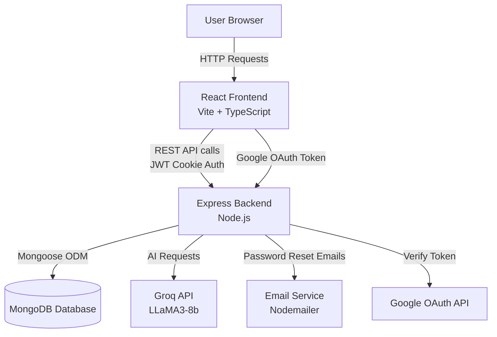
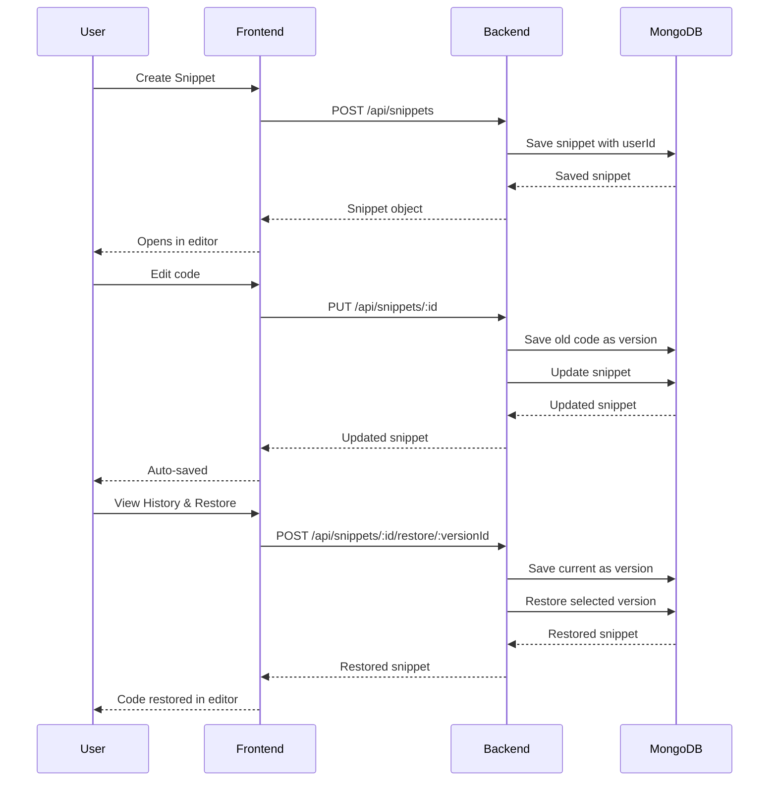
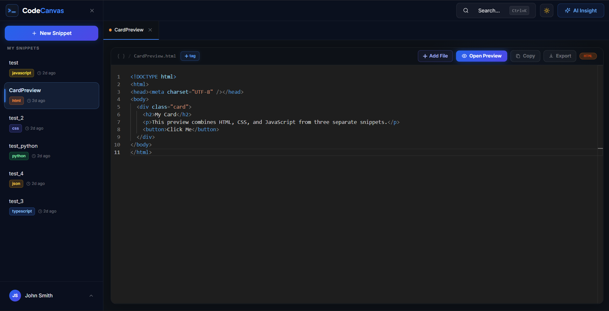
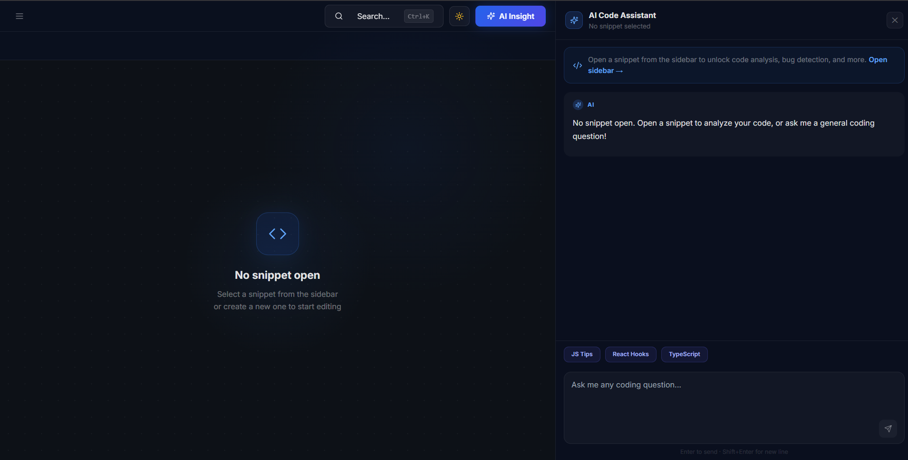
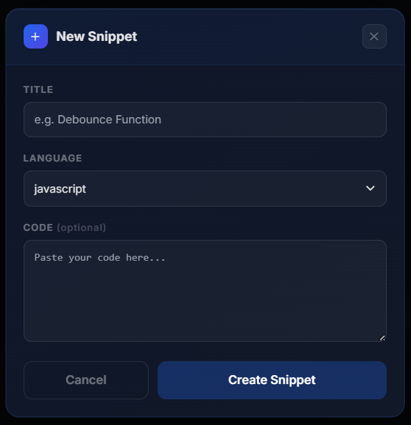

# CodeCanvas

> A modern, full-stack code snippet manager with AI assistance, version history, and a powerful Monaco editor.


---

## Features

- **Authentication** — Register, login, Google OAuth, forgot/reset password via email
- **Snippet Manager** — Create, edit, delete (with confirmation), rename, duplicate snippets
- **Monaco Editor** — Full-featured code editor with syntax highlighting for 9 languages
- **Run & Preview** — Execute JavaScript/TypeScript and preview HTML/CSS/JS output live
- **AI Assistant** — Groq-powered AI chat to explain logic, find bugs, and optimize code
- **Version History** — Auto-saves up to 10 versions per snippet with one-click restore
- **Tags** — Organize and filter snippets by custom tags
- **Smart Search** — Search snippets by title, language, or tag instantly
- **Export & Copy** — Export snippets as files or copy code to clipboard
- **Resizable Panels** — Drag to resize the AI panel and version history panel
- **Dark / Light Theme** — Full theme support across all components

---

## System Architecture



---

## Data Flow — Snippet Lifecycle



---

## Tech Stack

| Layer | Technology |
|-------|-----------|
| Frontend | React 18, TypeScript, Vite |
| Editor | Monaco Editor |
| Styling | Tailwind CSS, shadcn/ui, Inline styles |
| Backend | Node.js, Express.js |
| Database | MongoDB, Mongoose |
| Auth | JWT (httpOnly cookies), Google OAuth |
| AI | Groq API (LLaMA3-8b-8192) |
| Email | Nodemailer |

---

## Project Structure

```
CodeCanvas/
├── frontend/
│   ├── src/
│   │   ├── components/       # Sidebar, EditorPanel, AiPanel, SearchModal, etc.
│   │   ├── pages/            # Dashboard, Login, Register, ForgotPassword, etc.
│   │   ├── lib/              # Axios instance, helpers
│   │   ├── types/            # TypeScript interfaces
│   │   └── utils/            # Theme tokens, badge colors, time formatting
│   ├── .env
│   └── package.json
│
└── backend/
    ├── controllers/          # auth.controller.js, snippet.controller.js
    ├── models/               # user.model.js, snippet.model.js, snippetVersion.model.js
    ├── routes/               # auth.routes.js, snippet.routes.js
    ├── middleware/           # authMiddleware.js
    ├── services/             # emailService.js
    ├── .env
    └── package.json
```

---

## Getting Started

### Prerequisites
- Node.js v18+
- MongoDB (local or Atlas)
- Groq API key — [console.groq.com](https://console.groq.com)
- Google OAuth credentials — [console.cloud.google.com](https://console.cloud.google.com)

### 1. Clone the repository
```bash
git clone https://github.com/bhavya310305-cyber/CodeCanvas.git
cd CodeCanvas
```

### 2. Backend setup
```bash
cd backend
npm install
```

Create a `.env` file in the `backend` folder:
```env
MONGO_URI=your_mongodb_connection_string
PORT=5000
FRONTEND_URLS=http://localhost:5173
JWT_SECRET=your_jwt_secret_key
GOOGLE_CLIENT_ID=your_google_client_id
GROQ_API_KEY=your_groq_api_key
EMAIL_USER=your_email@gmail.com
EMAIL_PASS=your_email_app_password
CLIENT_URL=http://localhost:8080
```

```bash
npm run dev
```

### 3. Frontend setup
```bash
cd frontend
npm install
```

Create a `.env` file in the `frontend` folder:
```env
VITE_GOOGLE_CLIENT_ID=your_google_client_id
```

```bash
npm run dev
```

### 4. Open the app
Visit `http://localhost:8080`

---

## API Endpoints

| Method | Endpoint | Description |
|--------|----------|-------------|
| POST | `/api/auth/register` | Register new user |
| POST | `/api/auth/login` | Login user |
| POST | `/api/auth/google` | Google OAuth login |
| POST | `/api/auth/logout` | Logout user |
| POST | `/api/auth/forgot-password` | Send reset email |
| POST | `/api/auth/reset-password/:token` | Reset password |
| GET | `/api/snippets` | Get all user snippets |
| POST | `/api/snippets` | Create new snippet |
| PUT | `/api/snippets/:id` | Update snippet |
| DELETE | `/api/snippets/:id` | Delete snippet |
| GET | `/api/snippets/:id/versions` | Get version history |
| POST | `/api/snippets/:id/restore/:versionId` | Restore a version |
| POST | `/api/ai/ask` | Ask AI about code |

---

## Screenshots

### Dashboard — Code Editor


### AI Code Assistant


### New Snippet


---

## License

MIT © [bhavya310305-cyber](https://github.com/bhavya310305-cyber)
